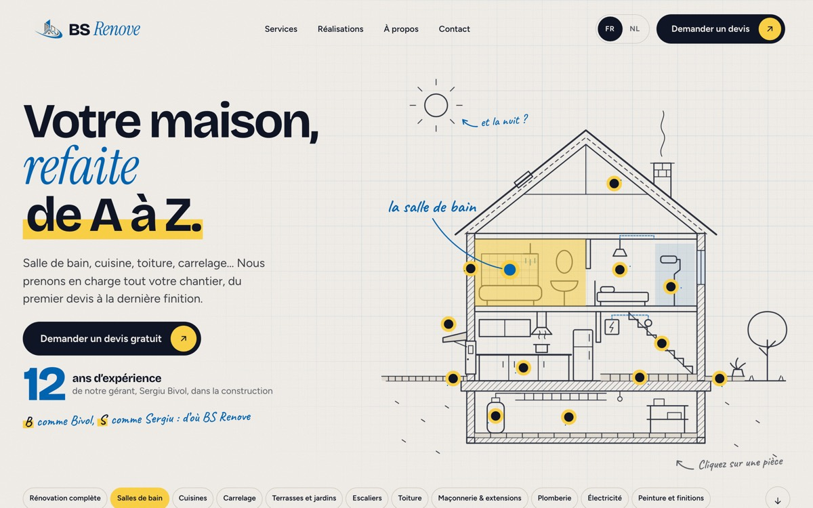
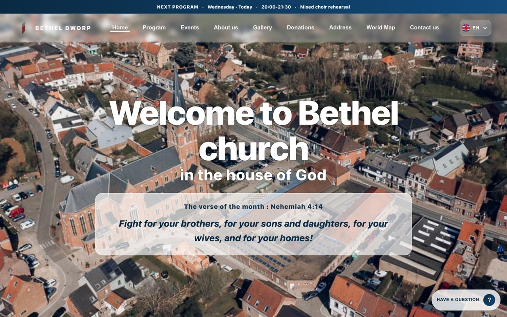

## Hi, I'm Claudiu

I'm a developer based in Belgium. I build websites and mobile apps for businesses: fast, multilingual, easy to use on a phone, and made to get customers to call or get in touch.

Websites: Astro · Next.js · TypeScript · Mobile apps: React Native · Expo

---

### Websites I've built

<table>
  <tr>
    <td width="50%" valign="top">
      
      <h4><a href="https://bsrenovesrl.com">BS Renove</a></h4>
      Renovation company, Welle. Real before/after sliders from their building sites, one page per trade, and a quote request in two steps.  
      Astro · French & Dutch · no cookies · <a href="https://github.com/ImTheCloud/bs-renove">code</a>
    </td>
    <td width="50%" valign="top">
      
      <h4><a href="https://www.betheldworp.be">Bethel Dworp</a></h4>
      Church community, Dworp. Weekly programme, events calendar, gallery and verse of the month, all updated by the church itself.  
      Next.js · Firebase · 4 languages · <a href="https://github.com/ImTheCloud/betheldworp">code</a>
    </td>
  </tr>
</table>

### Also

- [**MacGestureControl**](https://github.com/ImTheCloud/MacGestureControl): trackpad gestures for macOS that stay out of the way of the ones macOS already gives you (Swift).

---

**Need a website or an app for your business?** Write to me: [claudiu.dev@outlook.com](mailto:claudiu.dev@outlook.com)
